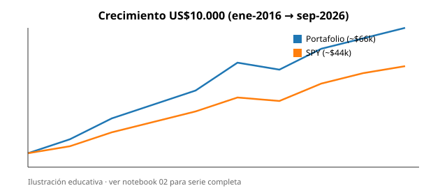
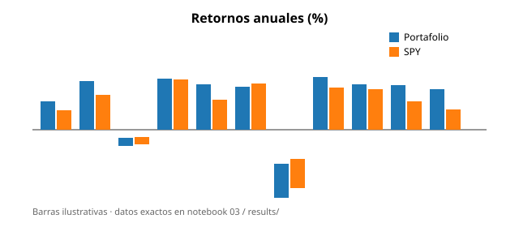
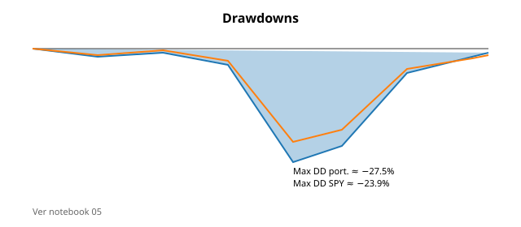
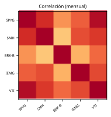
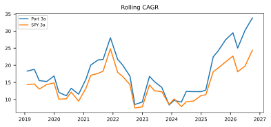
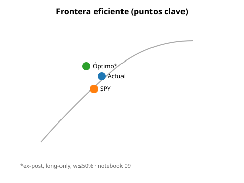

# Portafolio Backtest en Python

Réplica educativa del ejercicio **Backtest Portfolio Asset Allocation** de [Portfolio Visualizer](https://www.portfoliovisualizer.com/), actualizada a **septiembre 2026**, con los **pesos vivos** del portafolio en eToro y el **S&P 500 (`SPY`)** como benchmark.

> **No es asesoría de inversión.** Material para clase universitaria: juicio previo, ETL, código, métricas y conclusiones.

**Repo:** https://github.com/Andalejo1109/portafolio-backtest-python  
**Autor:** Alejandro Rodriguez L.  
**Fecha de pesos eToro:** 5 oct 2026, 11:45 a.m. (hora Colombia)

---

## Índice de capítulos (notebooks)

| # | Notebook | Contenido |
|---|---|---|
| 0 | [`notebooks/00_introduccion.ipynb`](notebooks/00_introduccion.ipynb) | Juicio previo, tesis, mapa del curso |
| 1 | [`notebooks/01_datos.ipynb`](notebooks/01_datos.ipynb) | ETL con `yfinance`, precios mensuales, RF |
| 2 | [`notebooks/02_crecimiento.ipynb`](notebooks/02_crecimiento.ipynb) | US$10.000, rebalanceo anual, vs SPY |
| 3 | [`notebooks/03_retornos_anuales_mensuales.ipynb`](notebooks/03_retornos_anuales_mensuales.ipynb) | Calendario anual + histograma |
| 4 | [`notebooks/04_metricas.ipynb`](notebooks/04_metricas.ipynb) | CAGR, σ, Max DD, Sharpe, Sortino, β, α, capture, TE, IR |
| 5 | [`notebooks/05_drawdowns.ipynb`](notebooks/05_drawdowns.ipynb) | Underwater chart |
| 6 | [`notebooks/06_activos.ipynb`](notebooks/06_activos.ipynb) | Riesgo–retorno por ticker |
| 7 | [`notebooks/07_rolling_returns.ipynb`](notebooks/07_rolling_returns.ipynb) | CAGR rodante 3y/5y |
| 8 | [`notebooks/08_correlacion.ipynb`](notebooks/08_correlacion.ipynb) | **Matriz de correlación (nuevo)** |
| 9 | [`notebooks/09_frontera_eficiente.ipynb`](notebooks/09_frontera_eficiente.ipynb) | Monte Carlo, máx Sharpe / mín vol |

Código compartido: [`src/portfolio_utils.py`](src/portfolio_utils.py) · script batch: [`run_analysis.py`](run_analysis.py)

---

## Juicio previo

Antes de mirar resultados:

1. Un núcleo **growth + semiconductores** debería **superar a SPY en CAGR** en 2016–2026, a costa de mayor volatilidad y peores caídas en 2022.
2. Sustituir el 5% de SPY del PDF e incorporar **~20% IEMG** debería **bajar un poco la correlación** con EE.UU., pero diluir retorno si emergentes rezagan.
3. `SMH`–`SPYG` serán altamente correlacionados (>0.8).
4. El Max DD del portafolio será **peor** que el de SPY.

---

## Metodología

| Parámetro | Valor |
|---|---|
| Datos | `yfinance` precios ajustados (total return) |
| Frecuencia | Mensual (último precio del mes) |
| Periodo original (validación) | ene-2016 → may-2025 |
| Periodo actualizado | ene-2016 → **sep-2026** |
| Capital inicial | US$10.000 |
| Aportes | Ninguno (como el PDF) |
| Rebalanceo | **Anual** (cierre de año) |
| Benchmark | `SPY` (aprox. VFINX del PDF) |
| Libre de riesgo | `^IRX` (T-Bill 13s) / 12 |
| Restricciones frontera | long-only, sin apalancamiento, peso ≤ 50% |

**Exposures / style analysis (Morningstar):** no se replican — requieren datos de fundamentals de pago. Se documenta aquí y se omite a propósito.

---

## Pesos usados

### Original (PDF Portfolio Visualizer)

| Ticker | Peso |
|---|---|
| SPYG | 42% |
| BRK.B | 27% |
| SMH | 15% |
| VTI | 11% |
| SPY | 5% |

### Actual (eToro, valor de mercado, sin efectivo)

Fuente: conector `user-Etoro-xai` → `get-my-portfolio-summary` (solo lectura), snapshot `2026-10-05T16:45:09Z`.

| Ticker | Valor US$ | Peso |
|---|---:|---:|
| SPYG | 14.970 | 30.51% |
| SMH | 10.676 | 21.76% |
| BRK-B | 10.009 | 20.40% |
| IEMG | 9.887 | 20.15% |
| VTI | 3.521 | 7.18% |
| **Total** | **49.063** | **100%** |

Núcleo thesis SPYG/SMH/BRK/IEMG/VTI — no había holdings materiales fuera de este set.

---

## Validación de la réplica (ene-2016 → may-2025, pesos PDF)

| Métrica | PDF | Réplica Python | Δ |
|---|---:|---:|---:|
| Valor final | 46.016 | 46,014 | -2 |
| CAGR | 17.60% | 17.60% | ~0 |
| Volatilidad | 16.31% | 16.31% | ~0 |
| Max DD | −25.59% | -25.59% | ~0 |
| Sharpe | 0.96 | 0.96 | ~0 |

La réplica es **fiel** (error de valor final < US$2).

---

## Resultados actualizados (ene-2016 → sep-2026)

| Métrica | Portafolio actual | SPY |
|---|---:|---:|
| Valor final (de US$10k) | **66,141** | 44,482 |
| CAGR | **19.21%** | 14.89% |
| Volatilidad | 16.54% | 15.04% |
| Max Drawdown | -27.47% | -23.93% |
| Sharpe | **1.02** | 0.85 |
| Sortino | 0.93 | 0.77 |
| Mejor año | 32.47% | 31.22% |
| Peor año | -21.02% | -18.18% |
| Beta vs SPY | 1.03 | 1.00 |
| Alpha anualizado | 3.62% | — |
| Upside capture | 108.8% | 100% |
| Downside capture | 89.6% | 100% |
| Tracking error | 5.73% | — |
| Information ratio | 0.75 | — |

### Correlación mensual (hallazgos)

| Par | ρ |
|---|---:|
| SPYG–VTI | 0.94 (máx.) |
| SPYG–SMH | 0.81 |
| SMH–BRK-B | 0.30 (mín. del núcleo) |
| IEMG–BRK-B | 0.38 |

### Frontera (ex-post, solo diagnóstico)

Óptimo máx. Sharpe histórico (peso ≤50%): ≈ SMH 46% + BRK-B 45% (sobreajuste; **no** usar como señal de trading).

---

## Figuras principales

Los notebooks (`notebooks/00`–`09`) incluyen las gráficas en sus salidas. Versiones SVG para GitHub:

### Crecimiento


### Retornos anuales


### Drawdowns


### Correlación


### Rolling returns


### Frontera eficiente


---

## Conclusiones actualizadas

1. **La réplica del PDF es sólida** (CAGR/Max DD/Sharpe alineados a 2 decimales).
2. **Con pesos vivos (más SMH + IEMG), el portafolio sigue batir a SPY** en CAGR (~19.2% vs ~14.9%) y Sharpe (~1.02 vs ~0.85) hasta sep-2026, con Max DD algo peor (~−27.5% vs ~−23.9%).
3. **IEMG aporta diversificación** pero históricamente diluye el motor EE.UU. growth.
4. **El alpha no es uniforme**: se concentra en años risk-on tech; 2022 es el régimen crítico.
5. **La frontera eficiente ex-post favorece SMH+BRK-B** — útil para discutir sobreajuste, no para rebalancear a ciegas.

---

## Cómo ejecutar

```bash
python -m venv .venv && source .venv/bin/activate
pip install -r requirements.txt
python run_analysis.py
cd notebooks && jupyter notebook
```

---

## Limitaciones

- Precios Yahoo ≠ vendor de Portfolio Visualizer.
- Sharpe/Sortino dependen de `^IRX`.
- Optimización media-varianza es **in-sample**.
- Sin impuestos/spreads/costos de rebalanceo.
- Exposures/style Morningstar omitidos (datos de pago).
